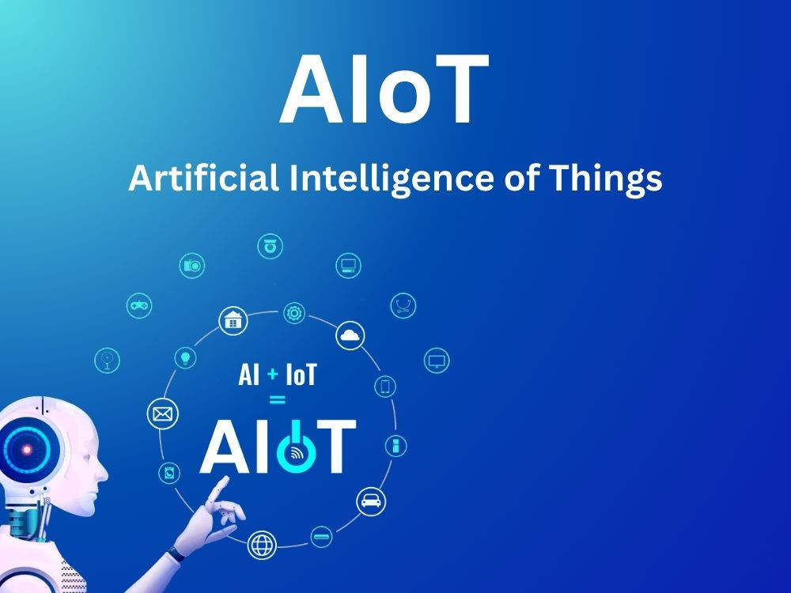

# 🌐 AIoT Workshop Project — October 2025  

### Combining Artificial Intelligence (AI) and Internet of Things (IoT)  

This repository showcases our works during a **3-day AIoT (Artificial Intelligence of Things)** workshop.  
The workshop focused on how **AI and IoT** merge to create **intelligent, connected systems** — covering everything from **hardware programming** and **server setup** to **AI agent integration** and **decision automation** using **LLMs (Large Language Models)**.

---

## 📅 Project Date  
**October 2025**

---

## 🚀 Workshop Overview  

### 🧠 Day 1 — Introduction & Foundations  
- Introduction to the **world of AIoT** and **intelligent agents**.  
- Learned about the **OODA Loop** (Observe, Orient, Decide, Act) as a decision-making model.  
- Hands-on setup with **ESP32**, connecting various sensors (temperature, light, motion).
  
### 🤖 Day 2 — Building the Intelligent Agent  
- Built a simple **Flask REST API** to receive and manage sensor data.  
- Created a **Python-based intelligent agent** to analyze sensor data.  
- Integrated **traditional rule-based logic** with **LLM reasoning** for smarter analysis.  
- Implemented anomaly detection and intelligent alerts based on environmental changes.  

### ⚙️ Day 3 — Decision Implementation & Final Project  
- Developed an endpoint in Flask to control physical devices (fan, LED).  
- Reviewed the **Agentic Loop:**  
  `Sense → Plan → Act → Reflect`  
- Built the **final AIoT project**: a complete system connecting ESP32 → Flask server → AI Agent → Actuators.  

---
## 🧩 Final Project Description  

**System Flow:**  
1. The **ESP32** collects live sensor data (temperature, light, motion).  
2. Data is sent over **Wi-Fi** to a **Flask server** via HTTP `POST` requests.  
3. A **Python intelligent agent** analyzes this data using:  
   - **Rule-based logic** for standard decisions.  
   - **LLM integration** for adaptive and contextual responses.  
4. The agent triggers appropriate actuator commands through the `/actuator` API (e.g., turn on fan, light).  
5. All results are logged using a **Logger** for performance review and continuous improvement.  

✅ This pipeline demonstrates a **real-time AIoT system**, transforming **data → insights → intelligent actions**.

---

## 🛠️ Technologies & Tools  
- **ESP32** — IoT hardware and sensor controller  
- **Python (Flask)** — API backend and AI Agent environment  
- **LLMs** — For intelligent data interpretation and decision-making  
- **Wi-Fi Communication** — For seamless device-server connectivity  

---

## 🙏 Acknowledgements  

A huge thanks to:  
- **[Expentech](https://www.linkedin.com/company/expentech-solution/)** — for organizing this workshop and sharing their AIoT expertise with us (IoT enthusiast trainees).  
- **[Digit Innovation Hub](https://www.linkedin.com/company/digit-innovation-hub)** — for hosting such inspiring and innovative training sessions.  

---

## 👥 Team Credits  

**Final Project Contributors:**  
- **Mohamad Izzat Kawadri** — [LinkedIn](https://www.linkedin.com/in/izzat-kawadri)  
- **Rosah Alnammour** — [LinkedIn](https://www.linkedin.com/in/rosah-alnammour/)  

---

## 💡 Summary  

This project embodies the power of **AIoT** — where connected devices become truly *intelligent*:  
- They **Sense** their surroundings,  
- **Plan** and **Decide** with AI, and  
- **Act** autonomously to improve outcomes.  

> The future of technology lies at the intersection of AI and IoT — and this project is one small step toward that future.  
